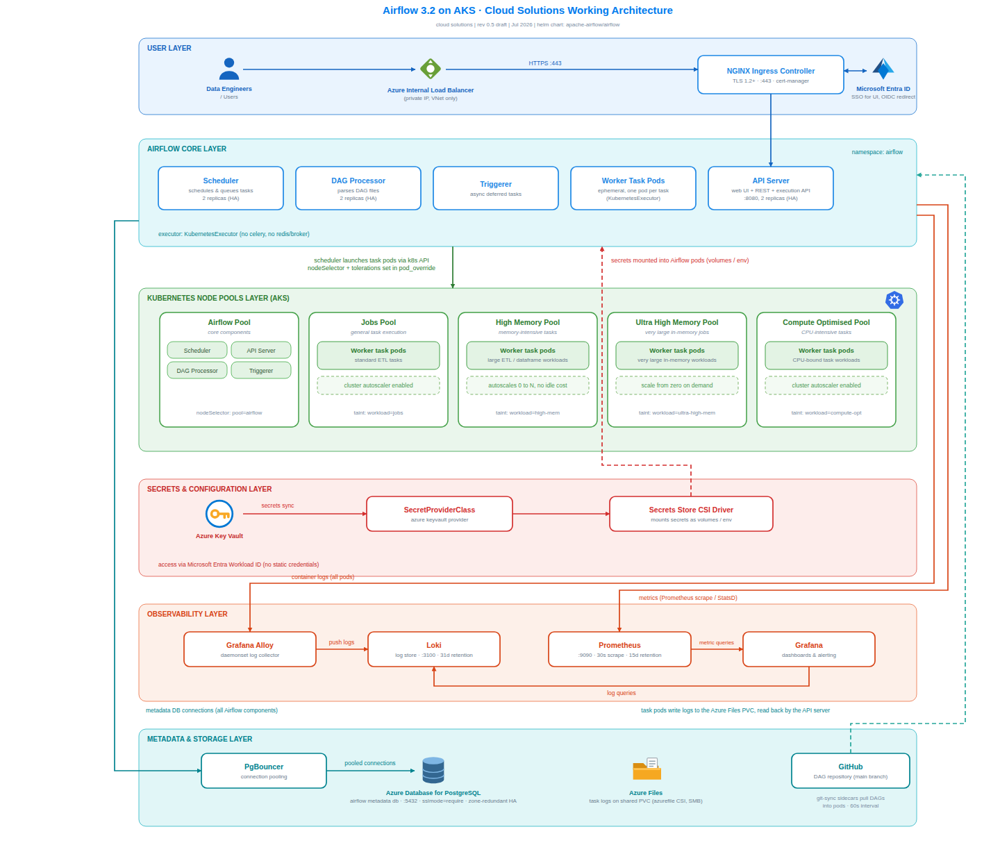

# Airflow 3.2 on AKS · Cloud Solutions Working Architecture

Architecture diagram of Apache Airflow 3.2 deployed on Azure Kubernetes
Service, drawn in the cloud-solutions working-architecture style: colored
layer bands, embedded vector icons, and operational annotations (replicas,
ports, taints, retention).



## Files

| File | Purpose |
|------|---------|
| `airflow-k8s-architecture.drawio` | Editable source — open at [app.diagrams.net](https://app.diagrams.net) or in the draw.io desktop app |
| `airflow-k8s-architecture.svg` | Vector render (identical geometry) |
| `airflow-k8s-architecture.png` | Raster preview |
| `generate_diagram.py` | Generator — emits the `.drawio` and `.svg` from one geometry definition |

**Visio:** open the `.drawio` file in draw.io and use *File → Export as → VSDX*.

**Icons:** all icons (Azure Key Vault, Load Balancer, Entra ID, Kubernetes,
PostgreSQL, Azure Files) are embedded as inline vectors / data URIs, so they
can never appear as broken images.

## Layers (top → bottom)

1. **User Layer** — Data engineers reach the platform through an Azure
   Internal Load Balancer (private IP, VNet only) → NGINX Ingress Controller
   (TLS 1.2+, :443, cert-manager), with Microsoft Entra ID for SSO / OIDC.
2. **Airflow Core Layer** (`namespace: airflow`) — Scheduler (2 replicas HA),
   DAG Processor (2 replicas HA), Triggerer, Worker Task Pods (ephemeral, one
   pod per task, KubernetesExecutor — no celery, no redis/broker), API Server
   (web UI + REST + execution API, :8080, 2 replicas HA).
3. **Kubernetes Node Pools Layer (AKS)** — the scheduler launches task pods
   via the k8s API; nodeSelector + tolerations set in `pod_override`:
   - **Airflow Pool** — core components (`nodeSelector: pool=airflow`)
   - **Jobs Pool** — standard ETL tasks (`taint: workload=jobs`)
   - **High Memory Pool** — large ETL / dataframe workloads
     (`taint: workload=high-mem`), autoscales 0→N
   - **Ultra High Memory Pool** — very large in-memory workloads
     (`taint: workload=ultra-high-mem`), scale from zero
   - **Compute Optimised Pool** — CPU-bound task workloads
     (`taint: workload=compute-opt`)
4. **Secrets & Configuration Layer** — Azure Key Vault → SecretProviderClass
   (azure keyvault provider) → Secrets Store CSI Driver mounts secrets into
   Airflow pods as volumes / env. Access via Microsoft Entra Workload ID —
   no static credentials.
5. **Observability Layer** — Grafana Alloy (daemonset) pushes container logs
   to Loki (:3100, 31d retention); Prometheus (:9090, 30s scrape, 15d
   retention) feeds Grafana dashboards & alerting, which also queries Loki.
6. **Metadata & Storage Layer** — PgBouncer pools connections to Azure
   Database for PostgreSQL (:5432, sslmode=require, zone-redundant HA);
   Azure Files PVC holds task logs (written by task pods, read back by the
   API server); GitHub is the DAG repository (git-sync sidecars pull DAGs
   into pods every 60s).

## Regenerating

```bash
python3 generate_diagram.py   # rewrites the .drawio and .svg
```

Edit geometry or labels in `generate_diagram.py`; both output files stay in
sync because they are emitted from the same coordinate data.
